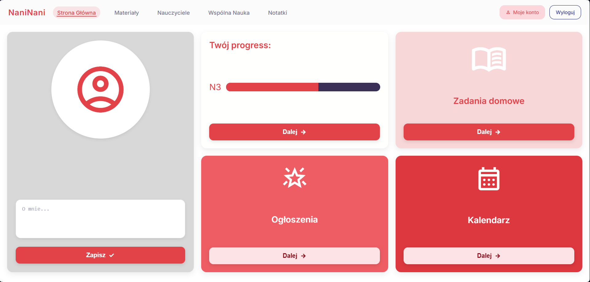
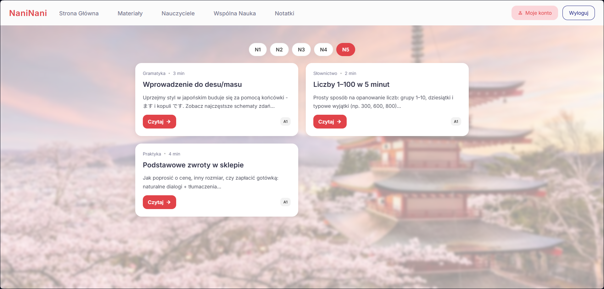
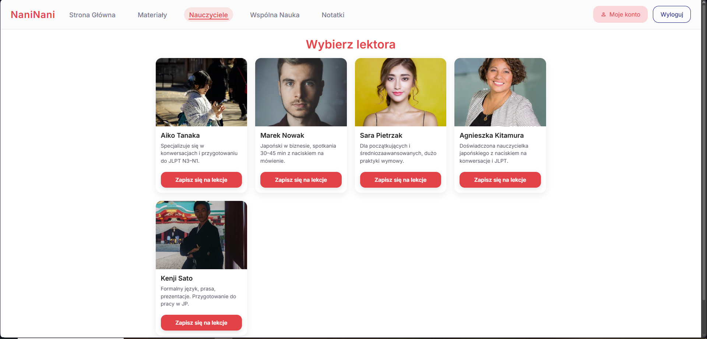
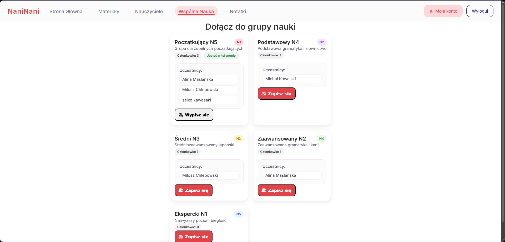
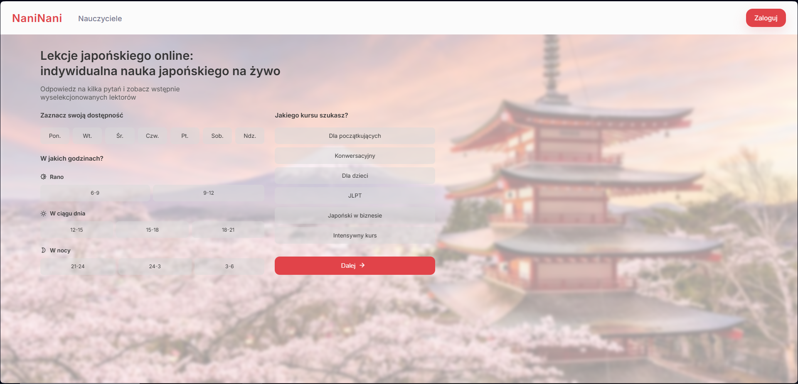
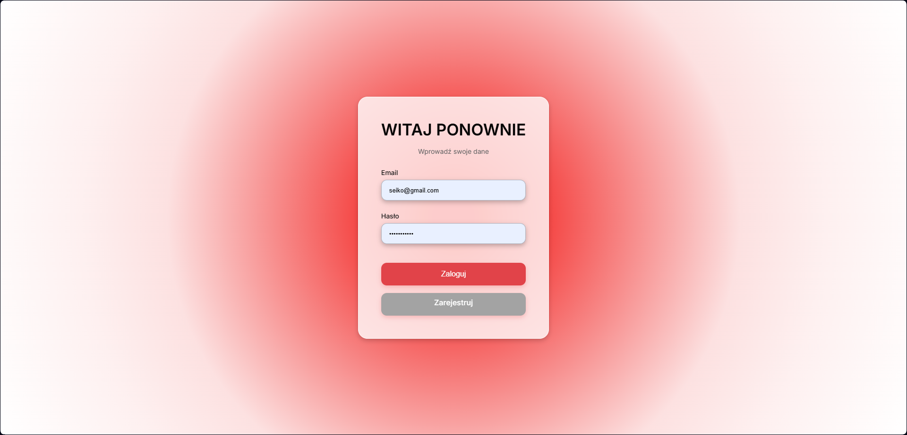
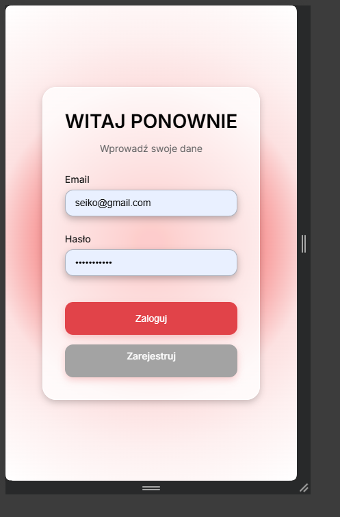
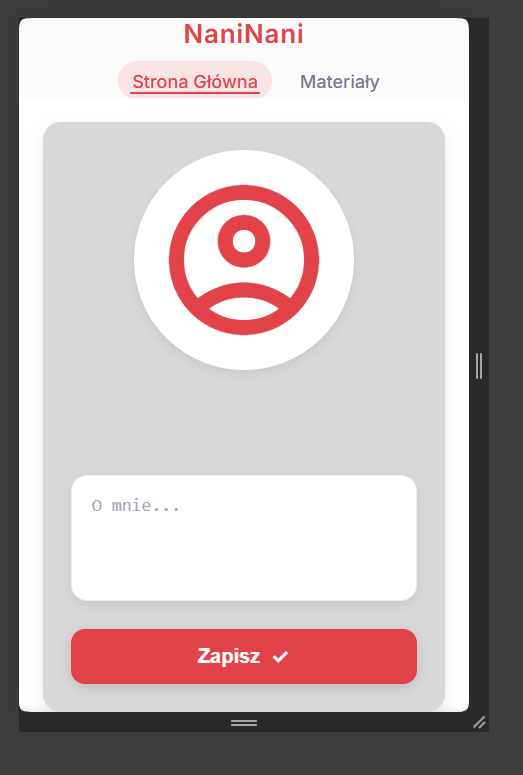
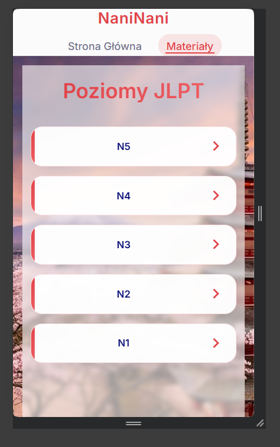

# NaniNani - platforma do nauki japońskiego

NaniNani to aplikacja webowa dla szkoły językowej, umożliwiająca rejestrację, logowanie, zarządzanie profilem, notatkami, dołączanie do grup oraz rezerwację lekcji online.

## Spis treści

- [Opis projektu](#opis-projektu)
- [Główne funkcje](#g%C5%82%C3%B3wne-funkcje)
- [Architektura](#architektura)
- [Jak uruchomić](#jak-uruchomi%C4%87)
- [Flow użytkownika](#przep%C5%82yw-u%C5%BCytkownika)
- [Struktura repozytorium](#struktura-repozytorium)
- [Screeny](#miejsce-na-screeny)

## Opis projektu

Aplikacja została zbudowana jako prosty system edukacyjny oparty na PHP oraz PostgreSQL. Frontend jest dostarczany przez szablony HTML i CSS, natomiast logikę biznesową obsługują klasy w folderze `www/src`.

## Główne funkcje

- Rejestracja i logowanie użytkownika.
- Panel użytkownika z możliwością edycji opisu własnego profilu.
- Widok główny z informacjami o postępach, zadaniach domowych i kalendarzu.
- Dodawanie prywatnych notatek dla ucznia.
- Dołączanie i wypisywanie się z grup nauki.
- Rezerwacja i usuwanie lekcji z poziomu kalendarza.
- Dynamiczne strony poziomów `N1`–`N5`.

## Architektura

Aplikacja działa w kontenerach Docker:

- `server` - Nginx serwujący pliki z katalogu `www`.
- `php-fpm` - PHP-FPM uruchamiające backend PHP.
- `db` - PostgreSQL przechowujący dane użytkowników, lekcje, grupy i notatki.

Kluczowe elementy:

- `compose.yml` - definicja środowiska Docker.
- `.env` - ustawienia środowiska, m.in. hasło do PostgreSQL.
- `postgres/init.sql` - schemat bazy danych i przykładowe grupy.
- `www/component/Bootstrap.php` - autoload klas i konfiguracja sesji.
- `www/router.php` - centralny punkt wczytywania widoków i nawigacji.
- `www/src/FrontController.php` - główny kontroler aplikacji.

## Jak uruchomić

1. Skopiuj lub dostosuj plik `.env`, jeśli potrzebujesz innego hasła do bazy.
2. Uruchom kontenery Docker:

```bash
docker compose up -d
```

3. Otwórz przeglądarkę pod adresem:

```text
http://localhost:8080
```

4. Aplikacja powinna uruchomić się automatycznie bez dodatkowej konfiguracji.

> Jeśli chcesz zainicjować bazę ponownie, usuń wolumen `postgres_data` i uruchom ponownie `docker compose up`.

## Flow użytkownika

1. Użytkownik ląduje na stronie startowej `index.php` i wybiera wstępne preferencje.
2. Następnie przechodzi do strony `teachers.php`, gdzie może podejrzeć dostępnych lektorów.
3. Korzystając z formularza, może się zarejestrować lub zalogować na `login.php` / `register.php`.
4. Po zalogowaniu trafia do `dashboard.php`:
   - edycja opisu profilu,
   - dostęp do kalendarza i lekcji,
   - szybki dostęp do notatek oraz grup.
5. Uczeń może dodawać notatki na `notes.php`.
6. Na `pairing.php` może przeglądać grupy i zapisywać się do nich.
7. Na `calendar.php` może rezerwować lekcje z wybranym nauczycielem, a także usuwać istniejące rezerwacje.
8. Dodatkowo dostępne są strony poziomów `level.php?page=1` ... `level.php?page=5` oraz `level.php?page=desu-masu`.

## Struktura repozytorium

- `compose.yml` - konfiguracja Dockera.
- `.env` - dane środowiska (hasło do Postgresa).
- `nginx.conf` + `conf.d/` - konfiguracja serwera Nginx.
- `postgres/init.sql` - schemat tabel i seedy dla grup.
- `www/` - aplikacja PHP i zasoby frontendu.
  - `component/Bootstrap.php` - bootstrap aplikacji.
  - `component/db.php` - dodatkowy bootstrap dla stron niezależnych.
  - `src/` - klasy PHP obsługujące logikę.
  - `levels/` - podstrony każdego poziomu kursu.
  - `*.php` - widoki stron i formularze.
  - `*.css` / `*.js` - style i skrypty frontendu.

## Screeny










